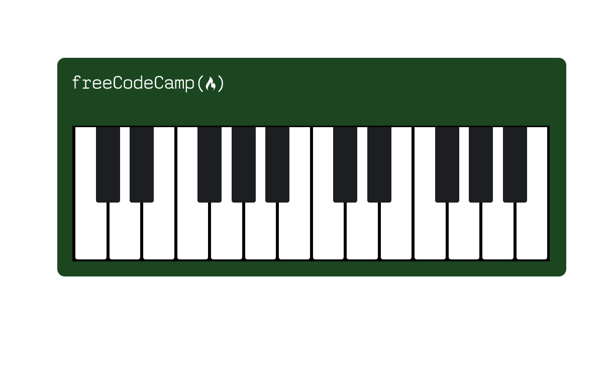

# building-a-piano

A webpage that features a piano designed using CSS.

**Live-Demo:** [https://oendemann.github.io/building-a-piano/]

---

---

## About The Page

A simple webpage that features a non-interactive piano. Part of the web design course on freeCodeCamp, with a focus on responsive web design in this project, as the piano resizes when the window resizes.

---

## Built With

* **HTML:** Used for the basic structure of the piano (mostly the organization of variables such as the black keys and logo).
* **CSS:** Used as the design of the piano (e.g. color, key placement/size, etc). Also used to create a adaptive piano size.

---

## What I Learned

1. Media queries in CSS can be used to make a responsive website (e.g. when the window is between x pixels in width and y pixels in height, the webpage does "blank").
2. Overflow of a variable can be hidden using the "overflow: hidden" syntax.

## Acknowledgments

* Project idea and requirements from [freeCodeCamp.org](https://www.freecodecamp.org/)